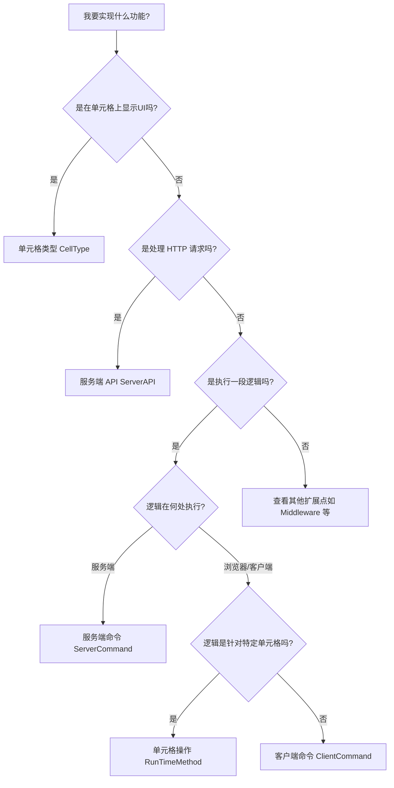

# 活字格插件开发技术决策树 (Decision Tree)

在开始开发之前，请根据以下逻辑选择最适合的技术路线。选择正确的插件类型可以显著降低开发复杂度并提升用户体验。

## 1. 核心决策逻辑

## 2. 场景详细对照表

| 需求场景 | 推荐路线 | 核心理由 |
| :--- | :--- | :--- |
| **刷新特定的图表单元格** | **[RunTimeMethod]** | 活字格内置“操作单元格”命令，可直接选定目标，无需手动查找 DOM。 |
| **清空自定义输入框的内容** | **[RunTimeMethod]** | 属于该单元格类型的固有行为。 |
| **弹窗显示当前用户信息** | **ClientCommand** | 属于通用的交互行为，不依赖特定单元格。 |
| **将数据写入数据库** | **ServerCommand** | 涉及敏感操作或大数据量处理，需在服务端安全执行。 |
| **对接外部系统的 Webhook** | **ServerAPI** | 需要提供固定的 URL 供外部调用。 |
| **在页面加载时修改请求头** | **Middleware** | 属于底层网络拦截需求。 |

## 3. 关键原则：[RunTimeMethod] 优先

如果你正在开发一个 `CellType`（单元格类型），并且需要提供一种方式让用户能够“控制”这个单元格（例如：开始播放、停止、重置、局部更新数据），**请务必优先使用 `[RunTimeMethod]`**。

**❌ 错误的做法**：
创建一个独立的 `ClientCommand` 插件，在 JS 中使用 `page.getCell("Name").getCellType().play()`。
*缺点*：用户需要配置命令参数来指定单元格名称，且开发者需要编写复杂的防御性代码。

**✅ 正确的做法**：
在 `CellType` 类中使用 `[RunTimeMethod]` 特性定义方法。
*优点*：用户直接使用活字格原生的“操作单元格”命令，在界面上直接勾选目标单元格，体验与内置组件（如音频、视频、图表）完全一致。

---
**相关参考**：
- [单元格高级操作](references/CellType/Action_AdvancedOperations.md)
- [基础结构说明](references/CellType/Basic_Structure.md)
